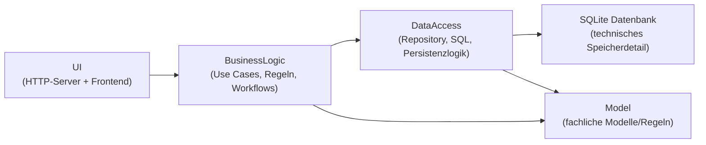

# Architekturdiagramm (1 Seite)

Abhängigkeitsrichtung gemäß Clean Architecture:

- `Model ← BusinessLogic ← UI`
- `Model ← BusinessLogic ← DataAccess ← Datenbank`

Leserichtung:

- `A ← B` bedeutet: **B hängt von A ab**.
